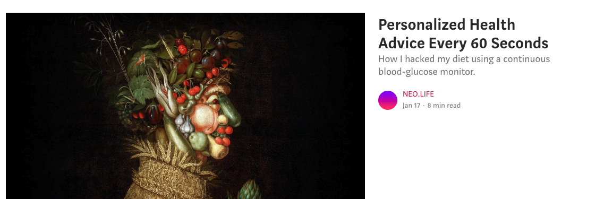

# Introduction {#intro}

This is a list of resources useful for building products that work with continuous glucose monitoring devices. Consider this document to be in the public domain, free to use however you like (but of course with absolutely no guarantees of accuracy).

 Start with this article by [Richard Sprague](https://twitter.com/sprague) at NEO.LIFE: ["Personalized Health Advice Every 60 Seconds"](https://neo.life/2019/01/personalized-health-advice-every-60-seconds/).

Also read this [good overview](https://medium.com/steady-health/the-ultimate-guide-to-continuous-glucose-monitors-cgm-611eecc70c9a) by Henrik Berggren from Steady.Health.

# News and User Experiences

-   **New York Times Health Reporter Anahad O'Connor** wrote about Nutrisense, January.ai, and his personal experience using Levels Health. <https://www.nytimes.com/2021/02/08/well/diet-glucose-monitor.html>

-   **Lydia Ramsey**, senior reporter at Business Insider wrote a detailed summary of using a Dexcom G6: <https://www.businessinsider.com/what-its-like-to-track-blood-sugar-with-a-continuous-glucose-monitor-2019-11>

-   **Eric Jain** wrote a short, highly-readable account of his month-long experience: <https://eric.jain.name/2018/11/25/tracking-blood-sugar/>

    -   And a [Hacker News thread](https://news.ycombinator.com/item?id=18891772) about his post

-   **Quantified Diabetes** does rigorous self-experimentation at <https://quantifieddiabetes.com/p/experiments.html>.\

-   **Lily Nichols** is a registered dietitian who wrote "[What I Learned as a Non-Diabetic](https://lilynicholsrdn.com/cgm-experiment-non-diabetic-continuous-glucose-monitor/)"

-   **Jimi S,** a 25-year-old diabetic wrote a lengthy review: [Review: FreeStyle Libre --- Abbott Diabetes Care \| by Jimi S.](https://medium.com/@JimiS/product-review-freestyle-libre-abbott-diabetes-care-561ee446eaa)

-   **"Quantified Bob" Troia** wrote "[How to measure personal glucose response to foods"](https://www.quantifiedbob.com/measuring-glycemic-glucose-response-foods/)

-   **Jennifer Wang** writes "Am I Crazy Because I Eat Too Much Sugar?": [https://medium.com/\@neogeo25/am-i-crazy-because-i-eat-too-much-sugar-a-cgm-experiment-5b310f334f10](https://medium.com/@neogeo25/am-i-crazy-because-i-eat-too-much-sugar-a-cgm-experiment-5b310f334f10)

-   Follow Jessie Inchaspe's incredible Instagram account on her experiences with food and CGM: <https://www.instagram.com/glucosegoddess/>

-   **Kevin Bass n-of-1**: A PhD student kept (2018-19) a[live Twitter feed](https://twitter.com/kevinstrials) of his CGM data
-   [Why Perfectly Healthy People Are Using Glucose Monitors:](http://time.com/4703099/continuous-glucose-monitor-blood-sugar-diabetes/)Time Magazine article from 2017
-   [Hacker News thread](https://news.ycombinator.com/item?id=15521882#15522046) about CGMs and sugar metabolism
-   [Interactive web app](https://personalscience.shinyapps.io/librelink/) with daily updates from the Personal Science glucose monitor.
-   [How accurate it is](https://imgur.com/a/2xNEgGA): a user posts side-by-side comparisons of Freestyle Libre vs pinprick
-   [Reddit forums](https://www.reddit.com/search?q=freestyle%20libre) Lots of posts in diabetes-related forums

[Libre2 announcement](http://abbott.mediaroom.com/2018-10-01-Abbott-s-FreeStyle-R-Libre-2-with-Optional-Real-Time-Alarms-Secures-CE-Mark-for-Use-in-Europe?fbclid=IwAR3B9sMnnUa44Aor42ctKUyAuUuG1ZLly3pnanVAAolX1PF6HRCV4SBaOyo) (Oct 2018)
