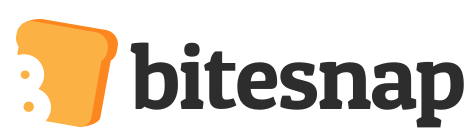

# Diet and food-tracking 

Apps and websites useful for nutrition tracking

<table>
  <tr>
   <td><strong>Bitesnap</strong>: take a photo of your food and get an AI-based identification, plus macronutrients and calories.  Recognizes 1300+ foods.
   </td>
   <td>
   </td>
   <td>

<a href="https://getbitesnap.com/">https://getbitesnap.com/</a>
   </td>
  </tr>
  <tr>
   <td><strong>LoseIt:</strong> Food database with 7 million+ foods, restaurant items and brands from around the world, hand curated by our on-staff nutrition experts.
   </td>
   <td>
   </td>
   <td>

<a href="https://www.loseit.com/">https://www.loseit.com/</a>
   </td>
  </tr>
  <tr>
   <td><strong>MyFitnessPal</strong> : 6 million foods, largest online community, connects to 50+ apps
   </td>
   <td>
   </td>
   <td>

https://www.myfitnesspal.com/
   </td>
  </tr>
  <tr>
   <td><strong>Cronometer</strong>

Large, curated food database. Widely used among professionals due to its in-depth tracking of nutrients and comprehensive data export. 
   </td>
   <td>
   </td>
   <td>

https://cronometer.com/
   </td>
  </tr>
</table>

