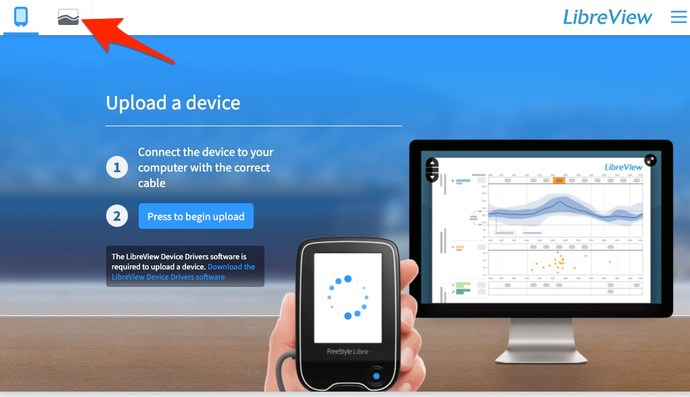

# Using Your CGM Data

Websites and apps that help you track glucose numbers

## Abbott Labs Official

The most important software for Freestyle Libre downloading is the officially-supported one here:

[https://provider.myfreestyle.com/freestyle-libre-resources.html](https://provider.myfreestyle.com/freestyle-libre-resources.html) 

Create an account on Libreview and then you can download your data as a CSV file here: 

[https://www.libreview.com/meter](https://www.libreview.com/meter)

Then click here: [https://www.libreview.com/glucosereports](https://www.libreview.com/glucosereports) 

If you have the Abbott custom reader device, you can also download a Mac or Windows version of Freestyle Libre personal CGM

## International versions

[table by [Chuck Kub](https://www.facebook.com/photo.php?fbid=1835069433269419&set=gm.751003141928341&type=3&theater&ifg=1)]

**China:** buy a reader plus 3 14-day sensor packs [through Taobao](https://item.jd.com/32498232197.html) for about 1800 RMB (USD$270)

## Third Party

Many organizations now offer ways to upload and use your Freestyle (or other CGM) data.

<table>
  <tr>
   <td><strong>Nightscout</strong>

“an open source, DIY project that allows real time access to a CGM data via personal website, smartwatch viewers, or apps and widgets available for smartphones”

See their app <a href="https://spike-app.com/">https://spike-app.com/</a>
   </td>
   <td>
   </td>
   <td> 

<a href="http://www.nightscout.info/">http://www.nightscout.info/</a>
   </td>
  </tr>
  <tr>
   <td><strong>Diasend</strong>

 (formerly called<a href="https://www-int.glooko.com/"> Glooko</a>) tries to let you upload data from anywhere
   </td>
   <td>
   </td>
   <td>

<a href="https://diasend.com/us">https://diasend.com/us</a>
   </td>
  </tr>
  <tr>
   <td><strong>Tidepool</strong> <a href="https://app.tidepool.org/patients">https://app.tidepool.org/patients</a>

Open-source non-profit place to upload glucose data 
   </td>
   <td>
   </td>
   <td>

<a href="https://tidepool.org">https://tidepool.org</a>
   </td>
  </tr>
  <tr>
   <td><strong>Diabetes:M </strong>
   </td>
   <td>
   </td>
   <td>

https://diabetes-m.com/
   </td>
  </tr>
  <tr>
   <td><strong>Glimp</strong> : popular Android app
   </td>
   <td>
   </td>
   <td>

<a href="https://play.google.com/store/apps/details?id=it.ct.glicemia">https://play.google.com/store/apps/details?id=it.ct.glicemia</a>
   </td>
  </tr>
</table>

# Open Source Software

*   **Nightscout xDrip+**: [https://github.com/JoernL/xDrip-plus](https://github.com/JoernL/xDrip-plus)
    *   supports wireless connections to G4, G5, G6, Medtrum A6, Libre via NFC and Bluetooth, 630G, 640G, 670G pumps and Eversense CGM via companion apps. Bluetooth Glucose Meters such as the Contour Next One, AccuChek Guide, Verio Flex & Diamond Mini as well as devices like the Pendiq 2.0 Insulin Pen
    *   44 contributors, very active since Nov 2014 (latest checkin Dec 2018)
    *   
*   **OpenLibreReader** iOS: [https://github.com/blueToolz/openLibreReader-iOS-](https://github.com/blueToolz/openLibreReader-iOS-)
    *   a project to connect the various Libre Transmitters to the iPhone.
    *   [Blog post](https://unendlichkeit.net/wordpress/openlibrereader-and-status/?lang=en) (Jan 2018) summarizing goals and status.
    *   latest commit Apr 2018;   Started in Nov 2017 by 2 Germans 
*   [https://github.com/UPetersen/LibreMonitor](https://github.com/UPetersen/LibreMonitor)  iOS NFC reader, includes hardware instructions
    *    last active: Nov 2018.  Started in 2016 by 3 guys from Germany 
*   **nahog / freestyle-libre-parser-viewer: **[https://github.com/nahog/freestyle-libre-parser-v tiewer](https://github.com/nahog/freestyle-libre-parser-viewer)
    *   A parser library and viewer for CSV generated by the Abbott Freestyle Libre flash glucose meter.
    *   From 2016, last commit June 2018; One guy from Ireland 
*   [cgmnalysis](https://cran.r-project.org/web/packages/cgmanalysis/index.html): R Package on CRAN and [Github](https://github.com/childhealthbiostatscore/R-Packages) cleans up data from multiple CGM devices
    *   Last update October 2019
